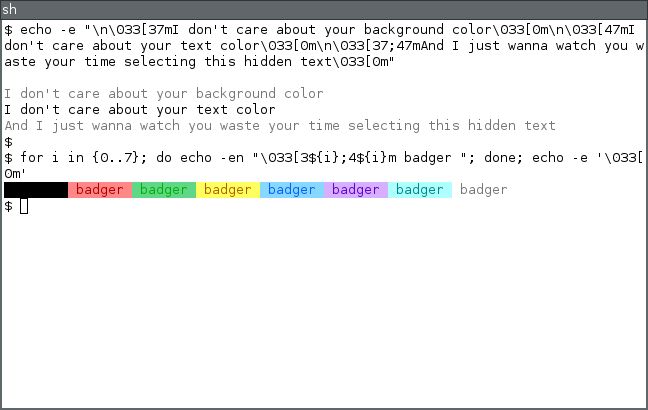
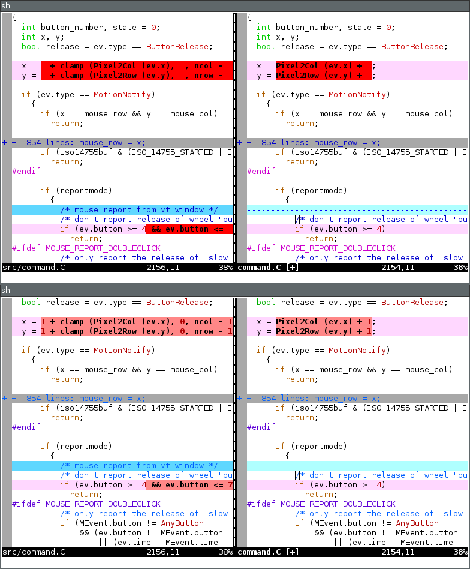

# split-palettes

Remaps colors 0—15 onto any of 256 colors, enabling separate color palettes for foreground and background.

## Why?

Sometimes developers don't bother supporting neither theming nor [`NO_COLOR`](https://no-color.org/) and just assume that everybody's obsessed with ~~k001h4x0r~~ dark themes, leaving me with white-on-white nonsense. Setting different colors for foreground and background color 7 allows me to have reasonably high-contrast text for both white-on-default and black-on-explicit-white color schemes.



Another example is default color scheme for vim. Sure, I might just tweak it, but I'm too lazy when it comes to not only modifying it, but also distributing configs onto various remote servers and dealing with occasionally missing terminfo for `rxvt-unicode-256color`. By having separate colors for background and foreground, I don't have to deal with conflicts between syntax highlighter and vimdiff, or search highlighing looking like vomit—all without configuring vim on any machine!



## Limitations

Only supports mapping within [the 8-bit lookup table](https://en.wikipedia.org/wiki/ANSI_escape_code#8-bit). 216-color RGB cube + 24 grayscale color palette is rather limited, but if you're really bothered, you can try massaging colors using [urxvt-xresources-256](https://github.com/Roliga/urxvt-xresources-256).

## Usage

Copy `screen-palettes` to `$HOME/.urxvt/ext`.

In `.Xdefaults`:
```
URxvt.perl-ext-common: ...,split-palettes,...

! set different colors for foreground white and background white
! supported values:
! "c123", where each number in the range 0—5 represents R, G, B values of colors from the 6×6×6 cube (colors 16—231)
! "g1"—"g24", selects one of grayscale colors (from the range 232—255)
! "123" replaces color 7 (as in "\033[37m") with color 123 (as in "\033[38;5;123m")
URxvt.split-palettes.fg7: g12
URxvt.split-palettes.bg7: c555

! same for yellow:
URxvt.split-palettes.fg3: c310
URxvt.split-palettes.bg3: c551
```
